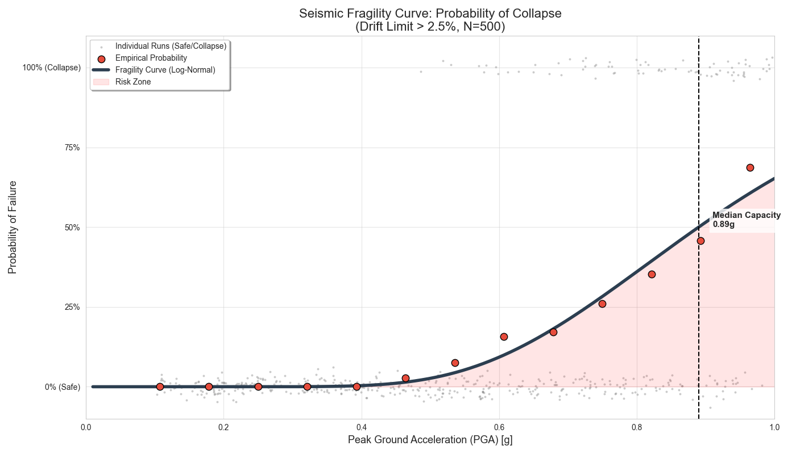

# 🏗️ Probabilistic Seismic Fragility Analysis

### 🎯 Overview
An advanced computational mechanics project designed to quantify the collapse probability of structures under seismic loads. Unlike deterministic methods, this engine uses a probabilistic approach (Monte Carlo) to derive **Fragility Curves**.

### ⚙️ How It Works
* **Custom Solver:** Implemented the **Newmark-Beta method** for non-linear time history analysis from scratch in Python (no external FEM software used).
* **Synthetic Earthquakes:** Generated 500 synthetic ground motion records using the Saragoni-Hart envelope function.
* **Monte Carlo Simulation:** Ran 500 parallel analyses with randomized structural properties (Mass, Stiffness uncertainty).
* **Data Fitting:** Fitted a Log-Normal Cumulative Distribution Function (CDF) to the simulation results to calculate the probability of failure at any given PGA.

### 📊 Visualization

*(Fig 1: The resulting Fragility Curve showing the probability of collapse exceeding 2.5% drift ratio across varying Peak Ground Accelerations. N=500 simulations)*

### 🛠️ Tech Stack
* **Core:** Python 3.11, NumPy (Vectorized Calculations)
* **Analysis:** SciPy (Curve Fitting, Optimization), Pandas
* **Visualization:** Matplotlib, Seaborn

---
> ⚠️ **Note:** Source code is available upon request for interview or demonstration purposes.
